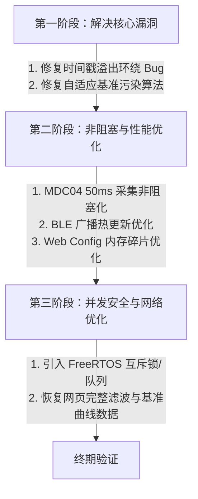

# 物联网水管理系统代码审查与重构路线图报告

本报告针对 `water_camera`、`water_relay` 和 `water_sensor_mdc04` 三个核心物联网工程进行深度的静态代码分析和架构评估，旨在指出系统目前存在的致命算法漏洞、多线程竞态风险、性能瓶颈以及通用的技术债务，并提出相应的重构规划。

---

## 一、 MDC04 采集节点 (`water_sensor_mdc04`) 审查报告

`water_sensor_mdc04` 负责通过 MDC04 电容传感器芯片采集多通道水分数据，并利用 BLE 广播和 MQTT 双路进行判定结果的输出。

### 1. 致命缺陷：自适应基准线污染 (Algorithmic Contamination)
*   **代码位置**：[Sensor.cpp:L65-94](file:///d:/Software/antigravity/water_sensor_mdc04/src/Sensor.cpp#L65-L94)
*   **现象分析**：
    在 `Sensor::pushRaw` 中，当前滤波后的电容值 `_filteredValue` 会在每一次采样时（1Hz）无条件被送入 `pushBaseline()` 用于更新干燥背景基准值 `_baselineValue`：
    ```cpp
    _filteredValue = pushFilter(value);
    _baselineValue = pushBaseline(_filteredValue); // 无论有水无水，基准始终在被实时更新
    ```
*   **后果**：
    1. **基准虚高**：如果传感器持续被水浸泡（`HAS_WATER` 状态持续超过 200 秒），基准值会上升到有水时的电容值。
    2. **虚假复位与震荡**：基准升高后，有水状态的检测阈值 `baselineValue - thresholdOffset` 同样变高，只要有轻微波动，系统就会错误地切回 `NO_WATER` 从而引发频繁的状态震荡。
    3. **干燥后“死区”**：水流干后，由于基准已被严重“污染”到有水时的高位，基准需要整整 200 秒的衰减时间才能归位。在此期间，新来水将完全无法被检测到，产生致命的安全漏洞。
*   **重构建议**：
    引入**基准冻结机制**。仅当当前状态为 `SensorState::NO_WATER` 时更新基准线；当状态跳转为 `SensorState::HAS_WATER` 时，冻结 `pushBaseline` 更新，直接维持进入有水状态前的最后一个稳定基准值。

### 2. 性能瓶颈：1-Wire 转换 50ms 阻塞延时
*   **代码位置**：[MDC04.cpp:L146](file:///d:/Software/antigravity/water_sensor_mdc04/src/MDC04.cpp#L146)
*   **现象分析**：
    读取 12 通道电容数据需要经历 `Convert C` 命令下达后的硬件模数转换等待，代码中使用了硬延时：
    ```cpp
    // 触发 Convert C 后
    delay(50); // 阻塞延时 50 毫秒
    ```
*   **后果**：
    该函数是在主循环 `loop()` 的 1Hz 定时器中同步调用的。这意味着每秒系统都有 50ms 会被强行挂起，这严重拖慢了 Web 服务器客户端处理（`s_server.handleClient()`）和 MQTT/BLE 的事件轮询，在高负荷或并发请求时极易导致 Web 页面加载卡顿甚至 TCP 超时。
*   **重构建议**：
    设计**非阻塞单总线采集状态机**：
    - 第一阶段：在主循环 1Hz 定时触发时，向所有芯片下发 `Convert C` 命令，并记录当前毫秒时间戳 `conversionStartTime`，随即立刻退出返回。
    - 第二阶段：在 `loop` 中判断 `millis() - conversionStartTime >= 50`，到达时间后再以异步非阻塞方式读取暂存器结果。

### 3. 系统隐患：BLE 广播高频启停
*   **代码位置**：[ble_adv.cpp:L54-56](file:///d:/Software/antigravity/water_sensor_mdc04/src/ble_adv.cpp#L54-L56)
*   **现象分析**：
    每秒更新数据时，广播模块都会先执行停止广播，再启动广播的操作：
    ```cpp
    s_pAdvertising->stop();
    s_pAdvertising->setAdvertisementData(advData);
    s_pAdvertising->start();
    ```
*   **后果**：
    在 ESP32 中频繁调用 BLE 广播的 `stop()` 与 `start()` 会对底层协议栈造成极大的调度开销，严重时会引起正在扫描该广播的网关端（如 `water_relay`）出现丢包，甚至使得接收端无法持续捕获连续包。
*   **重构建议**：
    在大多数 ESP32 Arduino 固件中，广播数据支持直接热更新而无需显式停止。应当移除 `stop()` 与 `start()` 的配对调用，直接调用 `setAdvertisementData()`，或仅在检测到有数据变动时才重置广播状态。


## 二、 控制网关节点 (`water_relay`) 审查报告

`water_relay` 负责扫描接收采集端的 BLE 广播包，依据 10 步状态机驱动三路水泵继电器和物理指示灯。

### 1. 致命缺陷：时间戳除以 1000 后的溢出环绕 Bug
*   **代码位置**：[SamplingController.cpp:L19-20](file:///d:/Software/antigravity/water_relay/src/SamplingController.cpp#L19-L20)
*   **现象分析**：
    在状态机更新函数中，获取系统时间及计算流逝时间的写法如下：
    ```cpp
    uint32_t nowSec = millis() / 1000;
    uint32_t elapsed = nowSec - stageStartTime;
    ```
*   **后果**：
    在 ESP32 持续运行约 49.7 天时，`millis()` 将溢出清零环绕。在此之前，`millis() / 1000` 将非常大（约为 `4294967`），而溢出发生的一瞬间，`nowSec` 会骤降到 `0` 附近。
    由于 `stageStartTime` 依然维持在溢出前的极高值，作减法 `nowSec - stageStartTime` 时会发生越界，计算出的 `elapsed` 将会是一个非常巨大的无符号正数（类似于 `4290000000`）。这会导致正在运行的状态机**瞬间通过所有超时判断条件，继电器疯狂吸合又释放，状态机跳跃失控**，极易导致溢水或水泵干烧事故！
*   **重构建议**：
    必须改回毫秒级的无符号减法，再转换为秒级。由于毫秒级直接相减会自动利用环绕特性确保计算正确：
    ```cpp
    uint32_t elapsed = (millis() - stageStartTimeMs) / 1000;
    ```

### 2. 多线程风险：网关接收端多线程竞态条件 (Race Condition)
*   **代码位置**：[SmartGateway.cpp:L186-217](file:///d:/Software/antigravity/water_relay/lib/ESP32SmartGateway/src/SmartGateway.cpp#L186-L217) 和 [main.cpp:L204-208](file:///d:/Software/antigravity/water_relay/src/main.cpp#L204-L208)
*   **现象分析**：
    - BLE 扫描匹配成功时，回调函数 `AdvertisedDeviceCallbacks::onResult` 会直接调用用户注册的 `_sensorCb`（即 `handleSensorData`），这个调用过程发生**在 FreeRTOS 的蓝牙核心任务上下文中**。
    - 该回调直接对全局缓存数据进行并发修改：
      ```cpp
      g_sensor_values[0] = sensor1; // 16位变量
      g_sensor_states[0] = (stateByte & 0x01) != 0;
      ```
    - 与此同时，ESP32 主任务（主线程 `loop()`）一直在高频读取 `g_sensor_states` 数组，作为控制状态机水泵输出的核心依据：
      ```cpp
      channelPumps[0] = channels[0].update(g_sensor_states[SENSOR_MAP_PUMP_0]);
      ```
*   **后果**：
    由于 ESP32 具有双核心且主任务与 BLE 任务是并发运行的，这种无保护的读写形成了典型的多线程竞态条件。在读取 16 位电容值 `sensorX` 时可能会读到更新了一半的“脏数据”，或是导致主循环中的状态自相矛盾。
*   **重构建议**：
    - **轻量化方案**：在读写全局传感器数据时，引入互斥锁（`SemaphoreHandle_t` 或 `portMUX_TYPE`）保护临界区。
    - **事件隔离方案**：利用 FreeRTOS 队列（Queue），在 BLE 任务接收到数据后将其塞入队列，主线程 `loop()` 每次在开始时出队并应用最新值，确保所有状态演进均在主线程单一上下文中完成。

### 3. 代码遗留：网页缓存数据的无意义清零
*   **代码位置**：[main.cpp:L241](file:///d:/Software/antigravity/water_relay/src/main.cpp#L241)
*   **现象分析**：
    在更新网页接口展示的传感器数据时：
    ```cpp
    // 由于 Sensor 类已被删除，我们将滤波/基准值/阈值全部简化为 0，仅保留 Raw 电容值及开关水状态
    web_config_update_sensor(i, g_sensor_values[i], 0, 0, 0, g_sensor_states[i]);
    ```
*   **后果**：
    这导致了前文所提及的“调试界面上电容值显示为 0 甚至丢失曲线”的历史技术债。即使前端能够通过 BLE 广播拿到真实值，网页后台也被强制覆盖为零，失去了网页端硬件远程调试与观测的能力。
*   **重构建议**：
    随着采集端 `water_sensor_mdc04` 在本地利用 `Sensor` 类自行算好“滤波值”、“基准值”、“阈值”并准备放入协议包中，网关的 BLE 协议应同步扩展。读取完整的字节包并填入网页缓存，恢复完整的波形监控。

---

## 三、 通用设计审查与技术债务报告

### 1. Web 配置模块中大量拼接 `String` 带来的 OOM (内存溢出) 隐患
*   **涉及项目**：`water_camera`, `water_relay`, `water_sensor_mdc04` 的 `web_config.cpp`
*   **现象分析**：
    三个项目在实现 API `/api/scan`（搜寻周边 WiFi）、`/api/sysconfig`、`/api/data` 时，都大量使用了如下代码形式：
    ```cpp
    String json = "{\"networks\":[";
    for(...) {
        json += "{\"ssid\":\"" + WiFi.SSID(idx) + "\",";
        json += "\"rssi\":" + String(WiFi.RSSI(idx));
        json += "}";
    }
    json += "]}";
    ```
*   **后果**：
    `String` 类的拼接（`+` 运算符）在单片机中表现为“分配新内存、拷贝、释放旧内存”的过程。当扫描到的 Wi-Fi 网络高达 20-30 个时，这会产生数十次极高频率的堆内存分配。
    因为 ESP32 堆内存具有高度碎片化特征，很可能在一连串拼接后，由于找不到一块连续的堆内存而直接抛出 **OOM（Out Of Memory）崩溃重启**。
*   **重构建议**：
    - **预分配内存**：拼接前估算长度并调用 `json.reserve(1500)`，这样能在一次分配中解决所有拼接，杜绝内存碎片。
    - **使用专用库**：改用 `ArduinoJson` 动态序列化输出到流，或者利用 `s_server.setContentLength(length)` 进行分块（Chunked）发送。

### 2. 局部头文件未遵循同目录放置规范
*   **审查规范**：根据本工作空间 `chinese_communication_workflow` 规范的第二点，所有非公共库的本地头文件（`.h`）应与其同名实现文件放置在同目录下。
*   **违规位置**：在 `water_relay` 中，`web_config.cpp` 的头文件挂载与配置结构稍显凌乱，某些内部配置文件交叉引入，增加了耦合。
*   **重构建议**：检查所有的本地定义，清除无用依赖。

---

## 四、 系统重构实施路线图 (Refactoring Roadmap)

为了系统化地解决上述技术债，我们制定了分步重构方案：


