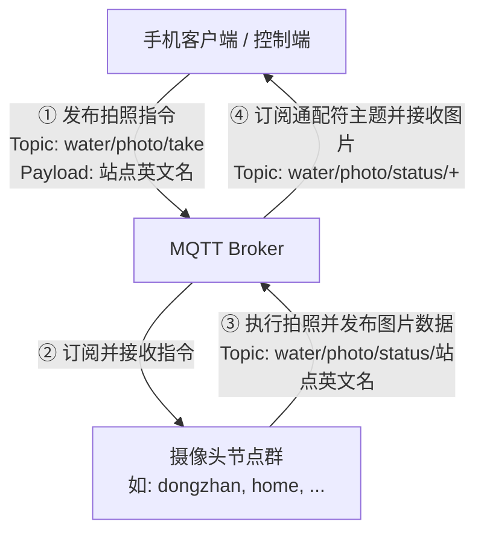
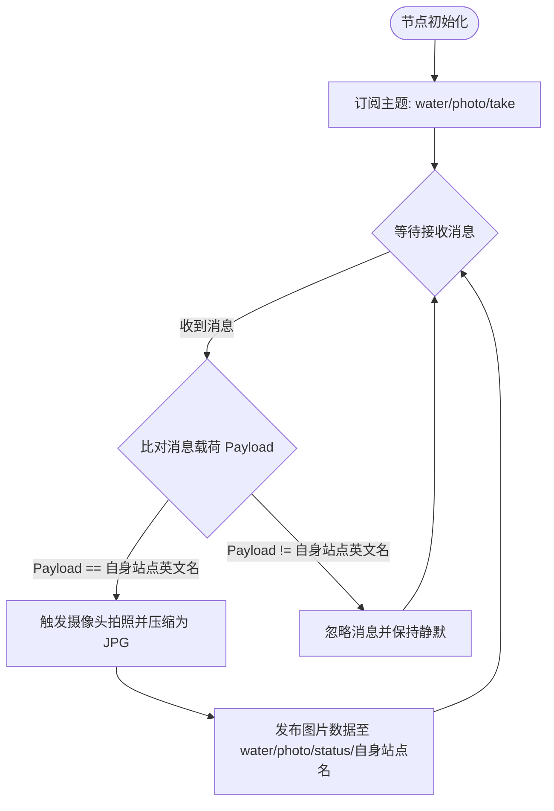
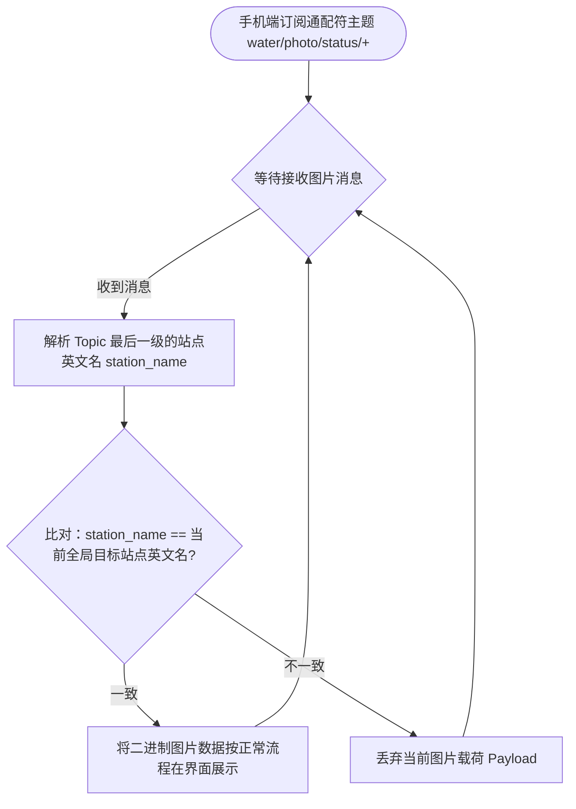

# 污水自动采样系统 - 摄像头 MQTT 通信协议与拍照控制逻辑规范

| 项目名称 | 摄像头 MQTT 通信协议与拍照控制逻辑规范 |
| :--- | :--- |
| 文档版本 | V1.0.0 |
| 创建日期 | 2026-06-27 |
| 项目状态 | 草稿 / 规划中 |
| 协议类型 | MQTT (Message Queuing Telemetry Transport) |

---

## 1. 概述

本规范旨在定义**污水自动采样系统**中，手机端客户端（Mobile App）与部署在各个采样站点的摄像头节点（Camera Nodes，例如 ESP32-S3 摄像头模块）之间的 MQTT 通信协议与拍照业务控制流程。

通过本协议，手机端可以向特定站点下发拍照指令，摄像头节点执行拍照并回传图像数据，手机端根据当前激活的目标站点进行过滤显示，实现多站点摄像头的有序调度与按需拍摄。

---

## 2. MQTT 通信角色与拓扑

在摄像头拍照通信中，手机端与摄像头节点分别承担以下角色：



| 通信主题 | 发布者 (Publisher) | 订阅者 (Subscriber) | 用途 |
| :--- | :--- | :--- | :--- |
| `water/photo/take` | 手机客户端 | 摄像头节点群 (所有节点订阅) | 下发拍照控制指令，载荷为目标站点英文名 |
| `water/photo/status/<station_name>` | 摄像头节点 | 手机客户端 (订阅 `water/photo/status/+`) | 回传拍摄的实时照片数据，主题末尾包含其站点英文名 |

---

## 3. 主题与消息格式规范

### 3.1 拍照控制主题 (`water/photo/take`)

* **主题名称**：`water/photo/take`
* **流向**：手机客户端 $\rightarrow$ 摄像头节点群 (QoS = 1)
* **载荷格式**：纯文本字符串 (Plain Text)
* **内容定义**：代表期望触发拍照的**站点英文名称**（例如 `dongzhan`）。
* **逻辑说明**：
  * 系统中的**所有**摄像头节点都必须在启动时订阅此主题。
  * 节点收到该消息后，比对载荷内容（Payload）是否与自身的站点英文名一致。
  * 若一致，则触发摄像头硬件拍照，并将图像回传；若不一致，则忽略该消息。

---

### 3.2 拍照状态回传主题 (`water/photo/status/<station_name>`)

* **主题名称**：`water/photo/status/<station_name>` （例如：`water/photo/status/dongzhan`）
* **流向**：摄像头节点 $\rightarrow$ 手机客户端 (QoS = 1)
* **载荷格式**：二进制字节流 (Binary / Image bytes, JPG 格式)
* **内容定义**：摄像头拍摄并压缩后的 JPG 照片原始二进制数据。
* **逻辑说明**：
  * 手机端需要订阅带有单级通配符的主题：`water/photo/status/+`。
  * 这样，手机端可以接收到所有站点回传的照片，然后通过匹配主题中的 `<station_name>` 进行过滤。

---

## 4. 摄像头节点与手机端控制逻辑

### 4.1 摄像头节点控制逻辑

每个摄像头节点在接收到控制指令后的执行逻辑如下：



---

### 4.2 手机端接收逻辑

手机端在订阅通配符主题 `water/photo/status/+` 后，处理收到的照片数据的逻辑如下：



---

## 5. 验证与测试方法

### 5.1 命令行模拟测试

在开发或联调阶段，可使用 `mosquitto_pub` 与 `mosquitto_sub` 命令行工具进行协议行为验证：

1. **手机端模拟下发拍照指令给特定站点 `dongzhan`**：
   ```bash
   mosquitto_pub -h voicevon.vicp.io -t water/photo/take -m "dongzhan"
   ```
2. **验证摄像头节点响应**：
   * 观察 `dongzhan` 站点的摄像头是否被触发拍照。
   * 观察其是否向 `water/photo/status/dongzhan` 发布二进制图片数据。
3. **模拟手机端订阅并接收图片并保存为本地 file**：
   * 模拟订阅接收：
     ```bash
     mosquitto_sub -h voicevon.vicp.io -t water/photo/status/+ -C 1 > received_photo.jpg
     ```
