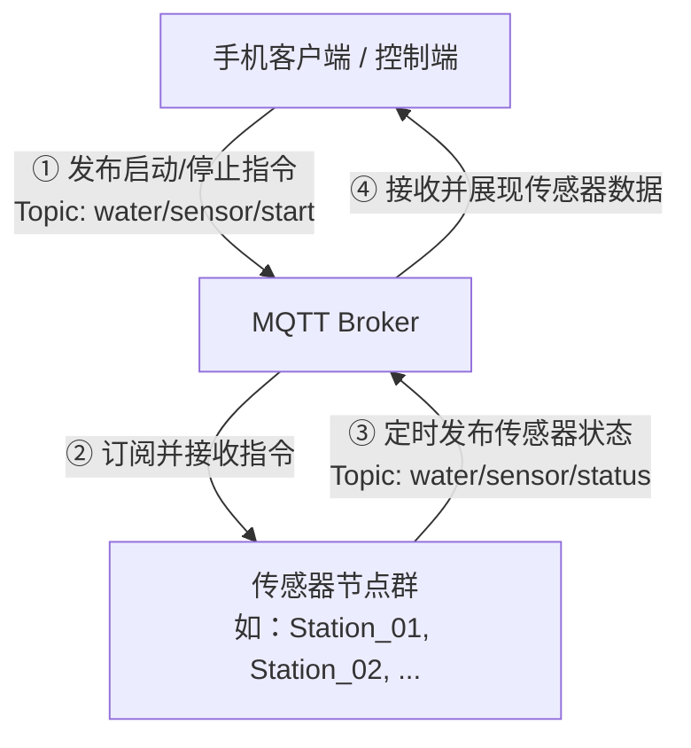

# 污水自动采样系统 - 传感器 MQTT 通信协议与控制逻辑规范

| 项目名称 | 传感器 MQTT 通信协议与控制逻辑规范 |
| :--- | :--- |
| 文档版本 | V1.0.0 |
| 创建日期 | 2026-06-26 |
| 项目状态 | 草稿 / 规划中 |
| 协议类型 | MQTT (Message Queuing Telemetry Transport) |

---

## 1. 概述

本规范旨在定义**污水自动采样系统**中，手机端客户端（Mobile App / Controller）与部署在各个采样站点的传感器节点（Sensor Nodes）之间的 MQTT 通信协议与业务逻辑控制流程。

通过本协议，手机端可以动态指定特定站点开始或停止数据采集与上报，而传感器节点根据接收到的控制指令动态调整自身的工作状态，实现能耗优化及数据按需传输。

---

## 2. MQTT 通信角色与拓扑

在系统通信中，手机端与传感器节点分别承担以下角色：



| 通信主题 | 发布者 (Publisher) | 订阅者 (Subscriber) | 用途 |
| :--- | :--- | :--- | :--- |
| `water/sensor/start` | 手机客户端 | 传感器节点群 (所有节点订阅) | 下发启动/停止数据采集的控制指令 |
| `water/sensor/status` | 传感器节点 | 手机客户端 / 后端服务 | 上报传感器实时数据（包含站点名称） |

---

## 3. 主题与消息格式规范

### 3.1 启动/停止控制主题 (`water/sensor/start`)

* **主题名称**：`water/sensor/start`
* **流向**：手机客户端 $\rightarrow$ 传感器节点群 (QoS = 1)
* **载荷格式**：纯文本字符串 (Plain Text)
* **内容定义**：代表期望启动的**站点名称**（例如 `Station_01`）。
* **逻辑说明**：
  * 系统中的**所有**传感器节点都必须在启动时订阅此主题。
  * 节点收到该消息后，需自行比对载荷内容是否与节点自身的名称一致，并据此决定开启或关闭数据定时上报。

---

### 3.2 传感器数据上报主题 (`water/sensor/status`)

* **主题名称**：`water/sensor/status`
* **流向**：传感器节点 $\rightarrow$ 手机客户端 / 后端服务 (QoS = 0 或 1)
* **载荷格式**：JSON 格式字符串 (JSON)
* **内容字段定义**：
  
  | 字段名 | 类型 | 说明 | 示例 |
  | :--- | :--- | :--- | :--- |
  | `name` | String | 传感器节点（站点）的唯一名称（必填） | `"Station_01"` |
  | `timestamp` | Long | 上报数据的时间戳（毫秒级，可选） | `1782489600000` |
  | `ph` | Float | 污水 pH 值数值（示例，根据具体硬件配置） | `7.2` |
  | `temperature` | Float | 污水温度数值，单位 ℃（示例，根据具体硬件配置） | `24.5` |
  | `turbidity` | Float | 污水浊度数值，单位 NTU（示例，根据具体硬件配置） | `12.3` |

* **载荷 JSON 示例**：
  ```json
  {
    "name": "Station_01",
    "timestamp": 1782489600000,
    "ph": 7.2,
    "temperature": 24.5,
    "turbidity": 12.3
  }
  ```

---

## 4. 传感器节点控制逻辑与状态机

每个传感器节点在接收到控制指令后的执行逻辑如下：

### 4.1 节点工作流程图

```mermaid
flowchart TD
    Start([节点初始化]) --> SubStart[订阅主题: water/sensor/start]
    SubStart --> WaitMsg{等待接收消息}
    
    WaitMsg -- 收到消息 --> CheckPayload{比对消息载荷 Payload}
    CheckPayload -- "Payload == 自身站点名称" --> StartReport[进入 [上报状态]]
    CheckPayload -- "Payload != 自身站点名称" --> StopReport[进入 [停止状态]]
    
    subgraph 上报状态
        StartReport --> StartTimer[启动定时器]
        StartTimer --> SendData[定时发布数据至 water/sensor/status]
    end
    
    subgraph 停止状态
        StopReport --> StopTimer[停止定时器]
        StopTimer --> Idle[静默等待]
    end
    
    SendData --> WaitMsg
    Idle --> WaitMsg
```

### 4.2 逻辑说明

1. **多路订阅与同名判定**：
   * 所有节点（如 `Station_01`, `Station_02`）在连上 MQTT Broker 后都必须订阅 `water/sensor/start`。
   * 手机端若想开启 `Station_01` 的数据传输，会在 `water/sensor/start` 发布内容 `"Station_01"`。
2. **启动定时上报**：
   * `Station_01` 接收到消息，判定 `payload == "Station_01"` 成立，启动内部定时器，以固定时间间隔（如每 5 秒）读取传感器数值，组装成包含自身名称的 JSON 报文并发布到 `water/sensor/status` 主题。
3. **停止定时上报**：
   * 与此同时，`Station_02` 也接收到该消息，判定 `payload ("Station_01") != 自身名称 ("Station_02")`。
   * `Station_02` 必须立即停止自身的定时上报，取消定时器，进入静默状态，从而避免多节点同时无序上报导致总线拥堵与功耗浪费。

---

## 5. 验证与测试方法

### 5.1 命令行模拟测试

在开发或联调阶段，可使用 `mosquitto_pub` 与 `mosquitto_sub` 命令行工具进行协议行为验证：

1. **模拟手机端订阅数据上报**：
   ```bash
   mosquitto_sub -h voicevon.vicp.io -t water/sensor/status -v
   ```
2. **模拟手机端下发启动 `Station_01` 指令**：
   ```bash
   mosquitto_pub -h voicevon.vicp.io -t water/sensor/start -m "Station_01"
   ```
3. **验证传感器节点响应**：
   * 观察是否有且仅有名称为 `"Station_01"` 的节点开始定时向 `water/sensor/status` 发布数据。
4. **模拟手机端下发启动 `Station_02` 指令**：
   ```bash
   mosquitto_pub -h voicevon.vicp.io -t water/sensor/start -m "Station_02"
   ```
5. **验证切换行为**：
   * 观察 `Station_01` 是否停止发送数据。
   * 观察 `Station_02` 是否开始定时向 `water/sensor/status` 发送数据。
