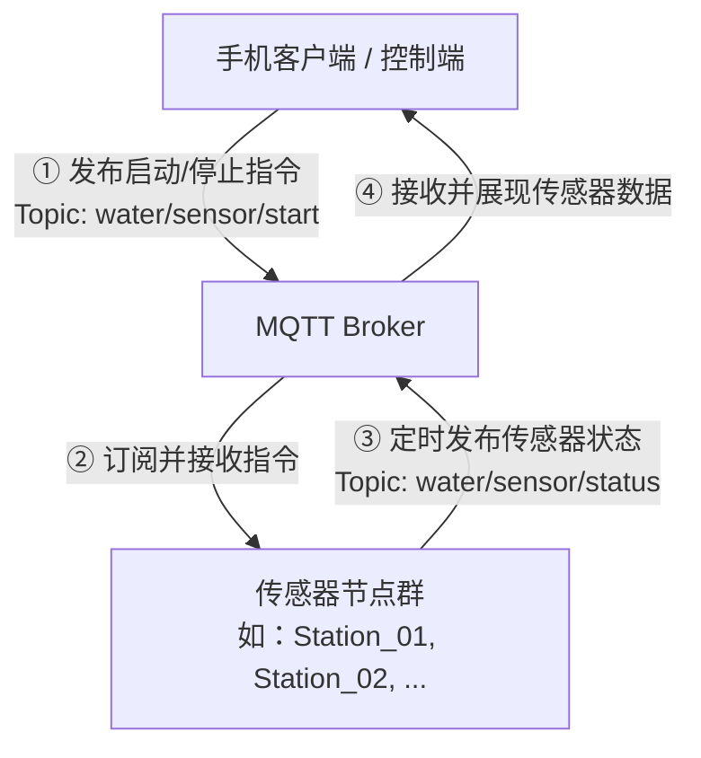

# 污水自动采样系统 - 传感器 MQTT 通信协议与控制逻辑规范

| 项目名称 | 传感器 MQTT 通信协议与控制逻辑规范 |
| :--- | :--- |
| 文档版本 | V1.1.0 |
| 创建日期 | 2026-06-26 |
| 最后更新 | 2026-09-20 |
| 项目状态 | 已实现 / 维护中 |
| 协议类型 | MQTT (Message Queuing Telemetry Transport) |

---

## 1. 概述

本规范旨在定义**污水自动采样系统**中，手机端客户端（Mobile App / Controller）与部署在各个采样站点的传感器节点（Sensor Nodes）之间的 MQTT 通信协议与业务逻辑控制流程。

通过本协议，手机端可以动态指定特定站点开始或停止数据采集与上报，而传感器节点根据接收到的控制指令动态调整自身的工作状态，实现能耗优化及数据按需传输。

---

## 2. MQTT 通信角色与拓扑

在系统通信中，手机端与传感器节点分别承担以下角色：


```mermaid
graph TD
    App[手机客户端 / 控制端] -- "① 发布启动/停止指令<br>Topic: water/sensor/start" --> Broker[MQTT Broker]
    Broker -- "② 订阅并接收指令" --> Nodes[传感器节点群<br>如：Station_01, Station_02, ...]
    Nodes -- "③ 定时发布传感器状态<br>Topic: water/sensor/status" --> Broker
    Broker -- "④ 接收并展现传感器数据" --> App
```

| 通信主题 | 发布者 (Publisher) | 订阅者 (Subscriber) | 用途 |
| :--- | :--- | :--- | :--- |
| `water/sensor/start` | 手机客户端 | 传感器节点群 (所有节点订阅) | 下发启动/停止数据采集的控制指令 |
| `water/sensor/status` | 传感器节点 | 手机客户端 / 后端服务 | 上报传感器实时数据（包含站点名称） |

---

## 3. 主题与消息格式规范

### 3.1 启动/停止控制主题 (`water/sensor/start`)

* **主题名称**：`water/sensor/start`
* **流向**：手机客户端 $\rightarrow$ 传感器节点群 (QoS = 2)
* **载荷格式**：JSON 字符串
* **启动指令**：
  ```json
  {"name": "Station_01", "interval": 5}
  ```
  * `name` (String, 必填)：期望启动的传感器节点（站点）名称。
  * `interval` (Int, 必填)：数据定时上报间隔（秒）。
* **停止指令**：
  ```json
  {"command": "stop"}
  ```
* **逻辑说明**：
  * 系统中的**所有**传感器节点都必须在启动时订阅此主题。
  * 节点收到启动指令后，比对 `name` 是否与自身名称一致：一致则按 `interval` 开启定时数据上报；不一致则忽略。
  * 节点收到 `command: "stop"` 指令后，无论自身名称是否被点名，都必须停止定时上报。

### 3.2 传感器数据上报主题 (`water/sensor/status`)

* **主题名称**：`water/sensor/status`
* **流向**：传感器节点 $\rightarrow$ 手机客户端 / 后端服务 (QoS = 0 或 1)
* **载荷格式**：JSON 格式字符串 (JSON)
* **内容字段定义**：

  | 字段名 | 类型 | 说明 | 示例 |
  | :--- | :--- | :--- | :--- |
  | `sensor1` | Int | 通道1 电容传感器原始读数（16位无符号） | `12345` |
  | `sensor2` | Int | 通道2 电容传感器原始读数（16位无符号） | `12300` |
  | `sensor3` | Int | 通道3 电容传感器原始读数（16位无符号） | `12200` |
  | `state` | Int | 远端有水状态位掩码：bit0~bit2 对应通道 1~3（1 = 有水） | `5` |
  | `ad1` | Int | HX711 通道1 24-bit 原始 AD 读数（可选，仅 HX711 设备上报） | `8100` |
  | `ad2` | Int | HX711 通道2 24-bit 原始 AD 读数（可选） | `8050` |
  | `ad3` | Int | HX711 通道3 24-bit 原始 AD 读数（可选） | `7990` |

* **载荷 JSON 示例**：
  ```json
  {
    "sensor1": 12345,
    "sensor2": 12300,
    "sensor3": 12200,
    "state": 5,
    "ad1": 8100,
    "ad2": 8050,
    "ad3": 7990
  }
  ```

* **手机端处理逻辑**：
  * 对每个通道独立做滑动均值滤波（窗口 50）、基准线计算（窗口 200）与施密特触发判断，得到**本地判定**状态。
  * 解析 `state` 位掩码得到**远端上报**状态。
  * 本地/远端双来源分别做边沿检测：无水→有水 触发告警（日志 + 系统通知 + TTS 循环播报）；有水→无水 记录恢复并解除告警。

---

## 4. 传感器节点控制逻辑与状态机

每个传感器节点在接收到控制指令后的执行逻辑如下：

### 4.1 节点工作流程图

```mermaid
flowchart TD
    Start([节点初始化]) --> SubStart[订阅主题: water/sensor/start]
    SubStart --> WaitMsg{等待接收消息}
    
    WaitMsg -- 收到消息 --> CheckCmd{是否为 stop 指令?}
    CheckCmd -- "是" --> StopReport[进入 [停止状态]]
    CheckCmd -- "否，为启动指令" --> CheckPayload{比对 name 与自身名称}
    CheckPayload -- "一致" --> StartReport[进入 [上报状态]]
    CheckPayload -- "不一致" --> Ignore[忽略消息并保持静默]
    
    subgraph 上报状态
        StartReport --> StartTimer[按 interval 启动定时器]
        StartTimer --> SendData[定时发布数据至 water/sensor/status]
    end
    
    subgraph 停止状态
        StopReport --> StopTimer[停止定时器]
        StopTimer --> Idle[静默等待]
    end
    
    SendData --> WaitMsg
    Idle --> WaitMsg
    Ignore --> WaitMsg
```

### 4.2 逻辑说明

1. **多路订阅与同名判定**：
   * 所有节点（如 `Station_01`, `Station_02`）在连上 MQTT Broker 后都必须订阅 `water/sensor/start`。
   * 手机端若想以 5 秒间隔开启 `Station_01` 的数据传输，会在 `water/sensor/start` 发布 `{"name":"Station_01","interval":5}`。
2. **启动定时上报**：
   * `Station_01` 接收到消息，判定 `name == "Station_01"` 成立，按 `interval` 启动内部定时器，定时读取传感器数值，组装成包含三通道读数与 `state` 状态位掩码的 JSON 报文并发布到 `water/sensor/status` 主题。
3. **停止定时上报**：
   * 手机端发布 `{"command":"stop"}` 后，所有节点（含 `Station_01`）必须立即停止自身的定时上报，取消定时器，进入静默状态，从而避免多节点同时无序上报导致总线拥堵与功耗浪费。

---

## 5. 验证与测试方法

### 5.1 命令行模拟测试

在开发或联调阶段，可使用 `mosquitto_pub` 与 `mosquitto_sub` 命令行工具进行协议行为验证：

1. **模拟手机端订阅数据上报**：
   ```bash
   mosquitto_sub -h voicevon.vicp.io -t water/sensor/status -v
   ```
2. **模拟手机端下发启动 `Station_01` 指令（5 秒间隔）**：
   ```bash
   mosquitto_pub -h voicevon.vicp.io -t water/sensor/start -m '{"name":"Station_01","interval":5}'
   ```
3. **验证传感器节点响应**：
   * 观察是否有且仅有名称为 `"Station_01"` 的节点开始定时向 `water/sensor/status` 发布数据。
4. **模拟手机端下发启动 `Station_02` 指令**：
   ```bash
   mosquitto_pub -h voicevon.vicp.io -t water/sensor/start -m '{"name":"Station_02","interval":5}'
   ```
5. **验证切换行为**：
   * 观察 `Station_01` 是否停止发送数据。
   * 观察 `Station_02` 是否开始定时向 `water/sensor/status` 发送数据。
6. **模拟手机端下发全局停止指令**：
   ```bash
   mosquitto_pub -h voicevon.vicp.io -t water/sensor/start -m '{"command":"stop"}'
   ```
   * 观察所有节点均停止发送数据。
